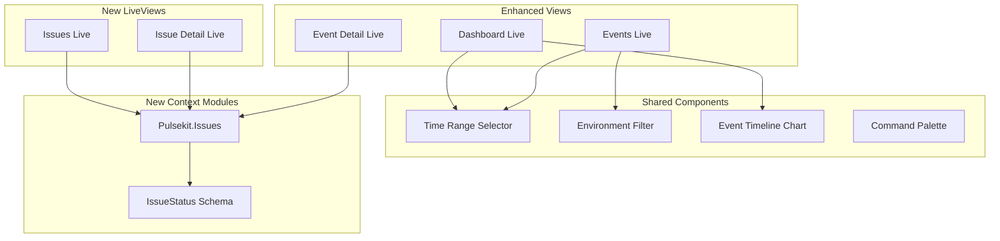

# PulseKit Dashboard Feature Enhancements

## Current State Summary

The dashboard currently offers:

- **Dashboard**: Stats cards, recent events, top event types
- **Events**: List view with level/search filtering, real-time updates
- **Event Detail**: Stacktrace, metadata, tags, context info
- **Alerts**: Webhook-based alert rules (threshold, pattern match, new error)
- **Projects/Organizations**: Basic CRUD management
- **Settings**: Retention, notifications toggles

---

## Proposed Features (Prioritized)

### 1. Issues View with Error Grouping

Group events by fingerprint to show unique issues rather than raw event streams. Engineers need to see "5 unique errors occurred 150 times" not just "150 events."**Implementation:**

- New `IssuesLive` view at `/issues`
- Add `Pulsekit.Issues` context module for aggregation queries
- Group by fingerprint with occurrence count, first/last seen, affected environments
- Status tracking: `unresolved`, `resolved`, `ignored`

**Key files:**

- New: [`lib/pulsekit_web/live/issues_live.ex`](server/lib/pulsekit_web/live/issues_live.ex)
- New: [`lib/pulsekit/issues.ex`](server/lib/pulsekit/issues.ex)
- Modify: [`lib/pulsekit_web/router.ex`](server/lib/pulsekit_web/router.ex)

---

### 2. Time Range Selector

Allow filtering data by time ranges across all views (dashboard, events, issues).**Ranges:** Last hour, 6 hours, 24 hours, 7 days, 30 days, Custom**Implementation:**

- Reusable `time_range_selector` component in [`core_components.ex`](server/lib/pulsekit_web/components/core_components.ex)
- Add time range params to `Events.list_events/2` and `Events.get_event_stats/2`
- Persist selection in URL params for shareability

---

### 3. Event Timeline Chart

Visual sparkline/chart showing event frequency over time on dashboard and issues view.**Implementation:**

- Add `Events.get_event_timeline/3` query returning bucketed counts
- Use colocated JS hook with Chart.js or simple SVG sparkline
- Show on Dashboard and Issue detail pages

---

### 4. Environment Filter

Filter events/issues by environment (production, staging, development, etc.).**Implementation:**

- Add environment dropdown to Events and Issues views
- Extend `Events.list_events/2` with `:environment` filter option
- Show environment distribution on dashboard

---

### 5. Issue Actions (Resolve/Ignore)

Let engineers mark issues as resolved or ignored to reduce noise.**Implementation:**

- Add `status` field to track issue state (stored per fingerprint)
- New schema: `Pulsekit.Issues.IssueStatus`
- Actions: Resolve, Ignore, Reopen
- Filter by status on Issues view

---

### 6. Similar Events Panel

On event detail page, show other events with the same fingerprint.**Implementation:**

- Query events by fingerprint in [`EventDetailLive`](server/lib/pulsekit_web/live/event_detail_live.ex)
- Display as collapsible panel with occurrence count and timeline

---

### 7. Quick Search / Command Palette

Global search with keyboard shortcut (Cmd+K) to quickly find events, issues, or navigate.**Implementation:**

- Modal component with search input
- Search across events (type, message), projects
- Keyboard navigation support

---

### 8. Live Tail Mode

Real-time streaming view that auto-scrolls as new events arrive.**Implementation:**

- Toggle button on Events page
- When enabled, new events prepend and view auto-scrolls
- Pause on user scroll, resume button

---

## Architecture Diagram

---

## Recommended Implementation Order

| Priority | Feature | Effort | Impact ||----------|---------|--------|--------|| 1 | Issues View with Error Grouping | Medium | High || 2 | Time Range Selector | Low | High || 3 | Environment Filter | Low | Medium || 4 | Issue Actions (Resolve/Ignore) | Medium | High || 5 | Event Timeline Chart | Medium | Medium || 6 | Similar Events Panel | Low | Medium || 7 | Quick Search | Medium | Medium |