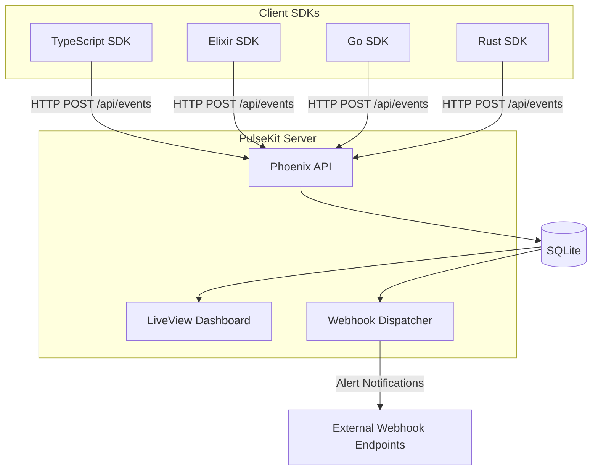
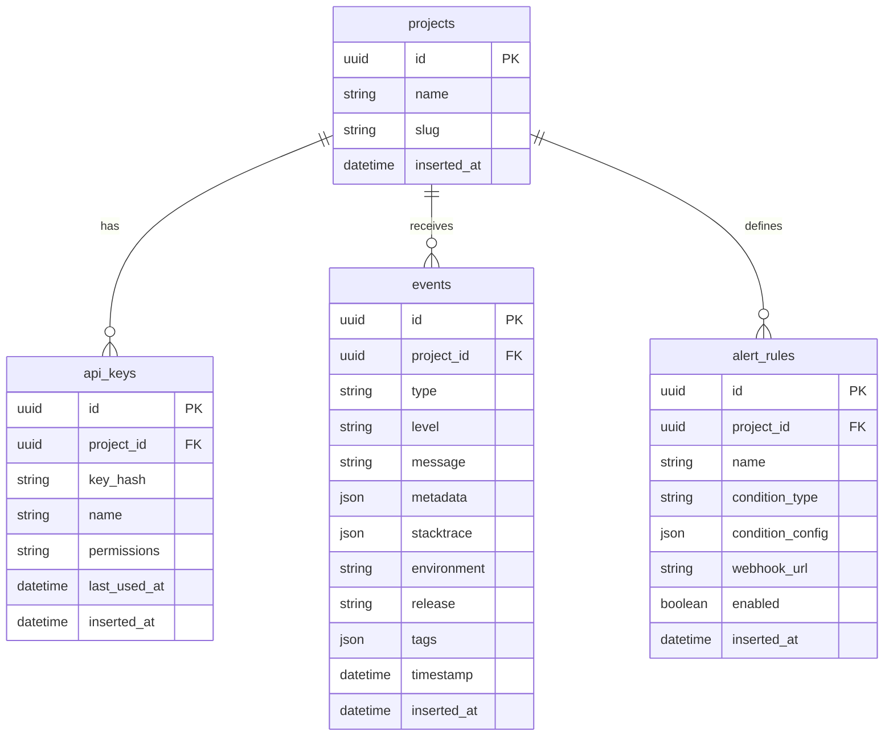

# PulseKit MVP Implementation Plan

## Architecture Overview




## Project Structure

```javascript
pulsekit/
├── server/                    # Phoenix application
│   ├── lib/
│   │   ├── pulsekit/          # Core business logic
│   │   │   ├── events/        # Event ingestion & storage
│   │   │   ├── projects/      # Project & API key management
│   │   │   ├── alerts/        # Alert rules & webhook dispatch
│   │   │   └── repo.ex        # SQLite repository
│   │   └── pulsekit_web/      # Web layer
│   │       ├── controllers/   # API controllers
│   │       ├── live/          # LiveView pages
│   │       └── components/    # UI components
│   ├── priv/
│   │   └── repo/migrations/   # Database migrations
│   └── config/
├── sdks/
│   ├── typescript/            # npm package @pulsekit/sdk
│   ├── elixir/                # hex package pulsekit
│   ├── go/                    # go module github.com/pulsekit/go
│   └── rust/                  # crates.io pulsekit
├── docker/
│   ├── Dockerfile
│   └── docker-compose.yml
└── README.md
```


## Phase 1: Phoenix Server Foundation

### 1.1 Initialize Phoenix Project

- Create new Phoenix project with LiveView (no Ecto default, we'll configure SQLite)
- Configure Ecto with `ecto_sqlite3` adapter
- Set up Tailwind CSS (ships with Phoenix)

### 1.2 Database Schema




### 1.3 Core API Endpoints

| Endpoint | Method | Description |

|----------|--------|-------------|

| `/api/v1/events` | POST | Ingest events (errors, custom events) |

| `/api/v1/events/batch` | POST | Batch event ingestion |

| `/api/v1/health` | GET | Health check for monitoring |Authentication: API key passed via `X-PulseKit-Key` header.

## Phase 2: LiveView Dashboard

### 2.1 Pages to Implement

1. **Dashboard Home** (`/`) - Overview with key metrics, recent events
2. **Events List** (`/events`) - Filterable, searchable event list with real-time updates
3. **Event Detail** (`/events/:id`) - Full event details, stacktrace viewer
4. **Projects** (`/projects`) - Manage projects and API keys
5. **Alerts** (`/alerts`) - Configure webhook alert rules
6. **Settings** (`/settings`) - User preferences, general settings

### 2.2 Real-time Features

- Use Phoenix PubSub to broadcast new events to connected LiveView clients
- Live-updating event counts and charts
- Real-time alert status indicators

### 2.3 UI Components

- Event severity badges (error, warning, info, debug)
- Stacktrace viewer with syntax highlighting
- Tag/label management
- Time-range selector for filtering
- Search with autocomplete

## Phase 3: SDKs

Each SDK should provide:

- Error/exception auto-capture
- Manual event sending
- Context/tag enrichment
- Batching and retry logic
- Configurable transport

### 3.1 TypeScript SDK (`sdks/typescript/`)

```typescript
// Usage example
import { PulseKit } from '@pulsekit/sdk';

const pulse = new PulseKit({
  endpoint: 'https://your-pulsekit.com',
  apiKey: 'pk_...',
  environment: 'production',
});

// Auto-capture errors
pulse.captureException(error);

// Custom events
pulse.capture({
  type: 'payment.success',
  level: 'info',
  message: 'Payment completed',
  metadata: { amount: 99.99, currency: 'USD' },
  tags: { customer_id: 'cust_123' },
});
```


### 3.2 Elixir SDK (`sdks/elixir/`)

```elixir
# Usage example
PulseKit.capture_exception(error)

PulseKit.capture(%{
  type: "payment.success",
  level: :info,
  message: "Payment completed",
  metadata: %{amount: 99.99, currency: "USD"},
  tags: %{customer_id: "cust_123"}
})
```


### 3.3 Go SDK (`sdks/go/`)

```go
// Usage example
pulsekit.CaptureException(err)

pulsekit.Capture(pulsekit.Event{
    Type:    "payment.success",
    Level:   pulsekit.Info,
    Message: "Payment completed",
    Metadata: map[string]any{"amount": 99.99},
    Tags:    map[string]string{"customer_id": "cust_123"},
})
```


### 3.4 Rust SDK (`sdks/rust/`)

```rust
// Usage example
pulsekit::capture_error(&err);

pulsekit::capture(Event {
    event_type: "payment.success",
    level: Level::Info,
    message: "Payment completed",
    metadata: json!({"amount": 99.99}),
    tags: HashMap::from([("customer_id", "cust_123")]),
});
```


## Phase 4: Alerting System

### 4.1 Alert Rule Types (MVP)

- **Threshold**: Trigger when event count exceeds N in time window
- **New Error**: Trigger on first occurrence of an error type
- **Pattern Match**: Trigger when event message matches regex

### 4.2 Webhook Payload

```json
{
  "alert": {
    "id": "alert_uuid",
    "name": "High Error Rate",
    "rule_type": "threshold",
    "triggered_at": "2026-01-07T12:00:00Z"
  },
  "project": {
    "id": "project_uuid",
    "name": "My App"
  },
  "events": [
    { "id": "...", "type": "error", "message": "..." }
  ],
  "context": {
    "event_count": 150,
    "time_window": "5m"
  }
}
```


## Phase 5: Docker Deployment

### 5.1 Dockerfile

- Multi-stage build for small image size
- Use official Elixir image
- Compile release with `mix release`
- Final image based on Debian slim

### 5.2 docker-compose.yml

```yaml
version: '3.8'
services:
  pulsekit:
    image: pulsekit/pulsekit:latest
    ports:
    - "4000:4000"
    volumes:
    - pulsekit_data:/app/data
    environment:
    - SECRET_KEY_BASE=...
    - DATABASE_PATH=/app/data/pulsekit.db
    - PHX_HOST=localhost

volumes:
  pulsekit_data:
```


## Key Dependencies

### Server (Elixir)

- `phoenix` ~> 1.7 - Web framework
- `phoenix_live_view` ~> 0.20 - Real-time UI
- `ecto_sqlite3` ~> 0.15 - SQLite adapter
- `jason` ~> 1.4 - JSON encoding
- `finch` ~> 0.18 - HTTP client for webhooks
- `heroicons` - Icon library

### TypeScript SDK

- Zero runtime dependencies (fetch API)
- TypeScript for type definitions

### Go SDK

- Standard library only (net/http)

### Rust SDK

- `reqwest` - HTTP client
- `serde` / `serde_json` - Serialization

## Implementation Order